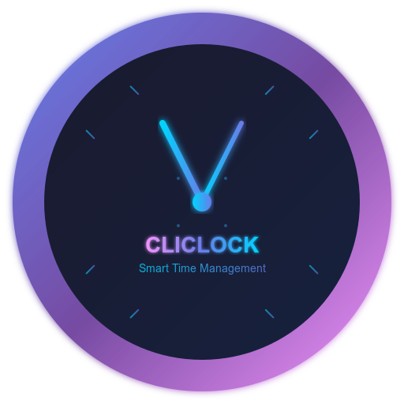

# Cliclock

## 📱 About Cliclock

Cliclock is a sleek and intuitive mobile app built with Flutter, designed to help you manage time effectively. Whether you need a precise clock, a countdown timer, or customizable settings, Cliclock has you covered! ⏰

## ✨ Features

- 🕒 **Digital Clock**: Accurate time display with customizable themes
- ⏱️ **Timer**: Set countdown timers for various tasks
- ⚙️ **Settings**: Personalize your experience with theme and preference options
- 📞 **Contact**: Easy access to support and feedback
- 🎨 **Themes**: Choose from beautiful UI's with Google Fonts integration

## 🚀 Download

Get the latest version of Cliclock for Android:

## 🛠️ Installation

1. Download the APK from the link above
2. Install on your Android device
3. Enjoy!

## 🤝 Contributing

Contributions are welcome! Feel free to open issues or submit pull requests.

